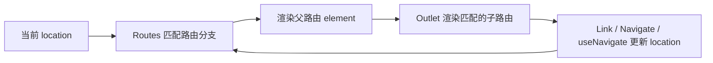

> 适用范围：React Router v7，Library Mode。当前项目使用 `BrowserRouter + Routes + Route`，没有在本模块中使用 Data Router 的 `loader`、`action` 和 `redirect()`。

## 1. 核心心智模型

React Router 的核心工作是让 URL、路由配置和 React 组件保持同步：



每次 location 变化，React Router 都会重新执行路由匹配。路由匹配本身只决定渲染哪些组件，不会自动发请求，也不会自动重定向。

## 2. 项目入口

当前项目在 `src/main.tsx` 中创建浏览器路由环境：

```tsx
<BrowserRouter basename={import.meta.env.BASE_URL}>
  <App />
</BrowserRouter>
```

`BrowserRouter` 负责：

- 读取浏览器地址栏；
- 监听 History API；
- 在导航时更新 URL；
- 向后代提供 location、navigation 和 route context。

`basename` 表示应用部署的基础路径。业务路由内部一般继续使用不包含 basename 的路径，例如 `/deep-mine/27`。

## 3. Routes 与 Route

### 3.1 基本结构

```tsx
<Routes>
  <Route path="/" element={<Home />} />
  <Route path="/companies" element={<CompanyLibrary />} />
</Routes>
```

- `<Routes>` 根据当前 location 选择最佳匹配分支。
- `<Route>` 只用于声明配置，不能脱离 `<Routes>` 单独渲染。
- `element` 是该路由匹配后需要渲染的 React 元素。
- React Router 会对路由进行排名，不应把它简单理解为从上到下命中第一条。

### 3.2 动态参数

```tsx
<Route path="/deep-mine/:taskId" element={<DeepMineTaskRoute />} />
```

访问：

```text
/deep-mine/27
```

可以通过 `useParams` 获取：

```ts
const { taskId } = useParams();
// taskId === "27"
```

URL 参数默认是字符串。业务代码应自行校验并转换为数字。

### 3.3 Layout Route

没有 `path` 的 Route 可以只提供布局：

```tsx
<Route element={<Layout />}>
  <Route index element={<Home />} />
  <Route path="companies" element={<CompanyLibrary />} />
</Route>
```

`Layout` 必须渲染 `<Outlet />`，否则匹配到的子页面没有显示位置。

## 4. 嵌套路由

路由声明的嵌套关系会形成父子路由树：

```tsx
<Route path="deep-mine/:taskId" element={<DeepMineTaskRoute />}>
  <Route index element={<DeepMineTaskRedirect />} />
  <Route path="targets" element={<DeepMineTargetsRoute />} />
  <Route path="clues" element={<DeepMineCluesRoute />} />
  <Route path="companies" element={<DeepMineCompaniesRoute />} />
  <Route path="*" element={<DeepMineTaskRedirect />} />
</Route>
```

URL 与子路由的对应关系：

| URL                       | 匹配的子路由 |
| ------------------------- | ------------ |
| `/deep-mine/27`           | `index`      |
| `/deep-mine/27/targets`   | `targets`    |
| `/deep-mine/27/clues`     | `clues`      |
| `/deep-mine/27/companies` | `companies`  |
| `/deep-mine/27/unknown`   | `*`          |

子路由的 `path` 默认相对于父路由。`companies` 最终会拼接成 `/deep-mine/:taskId/companies`。

## 5. Index Route 与通配路由

### 5.1 Index Route

```tsx
<Route index element={<DeepMineTaskRedirect />} />
```

Index Route 是父路由的默认子路由，只在 URL 正好停在父路径时匹配：

```text
/deep-mine/27
```

它没有自己的 path segment。

### 5.2 通配路由

```tsx
<Route path="*" element={<DeepMineTaskRedirect />} />
```

`*` 用于匹配该父路由下没有被其他子路由识别的剩余路径，例如：

```text
/deep-mine/27/unknown
```

当前项目让 index 和 `*` 都进入恢复逻辑，因此任务根路径和非法子路径都会根据任务详情重定向。

## 6. Outlet

### 6.1 Outlet 是子路由插槽

父路由组件通过 `<Outlet />` 指定子路由的渲染位置：

```tsx
function DeepMineTaskRoute() {
  return (
    <DeepMineProductsProvider>
      <Outlet />
    </DeepMineProductsProvider>
  );
}
```

假设当前 URL 是：

```text
/deep-mine/27/companies
```

渲染结构是：

```text
DeepMineTaskRoute
└── DeepMineProductsProvider
    └── Outlet
        └── DeepMineCompaniesRoute
            └── DeepMineExplore
```

如果父路由没有渲染 Outlet：

- 子路由仍然可能匹配；
- 但子路由组件不会出现在页面中。

### 6.2 Outlet 的内容会随 URL 改变

同一个父路由内导航时，父路由通常保持挂载，Outlet 的子内容发生变化：

```text
/deep-mine/27/clues
→ Outlet 渲染 DeepMineCluesRoute

/deep-mine/27/companies
→ Outlet 改为渲染 DeepMineCompaniesRoute
```

## 7. Outlet Context

父路由可以通过 Outlet 向匹配的子路由传递数据：

```tsx
<Outlet context={{ taskId, task }} />
```

子路由通过 `useOutletContext` 读取：

```ts
type DeepMineTaskContext = {
  taskId: number;
  task: GetTaskResponse;
};

const useDeepMineTaskContext = () => useOutletContext<DeepMineTaskContext>();
```

使用：

```ts
function DeepMineTaskRedirect() {
  const { taskId, task } = useDeepMineTaskContext();
}
```

Outlet Context 的特点：

- 作用域限定在当前 Outlet 渲染出的子路由分支；
- 父路由数据变化时，消费它的子路由会重新渲染；
- TypeScript 泛型只提供编译期类型；
- 它不是全局状态；
- 它不会持久化数据；
- 它不会自动请求接口。

可以将它理解为 React Router 为当前嵌套路由分支提供的局部 React Context。内部实现也是使用 Context Provider 包裹匹配到的 outlet。

## 8. Link、Navigate 与 useNavigate

### 8.1 对比

| API             | 使用场景                       | 触发方式     |
| --------------- | ------------------------------ | ------------ |
| `<Link>`        | 用户点击链接                   | 点击事件     |
| `<Navigate>`    | 组件渲染后重定向               | effect       |
| `useNavigate()` | 事件、异步流程或业务回调中导航 | 主动调用函数 |

### 8.2 Link

```tsx
<Link to={`/deep-mine/${task.id}`}>{task.title}</Link>
```

`Link` 会生成可访问的链接语义，并由 React Router 拦截站内导航，通常应优先用于用户可点击的普通跳转。

### 8.3 Navigate

```tsx
return <Navigate to="/login" replace />;
```

`Navigate` 是 `useNavigate` 的组件形式：

- 组件被渲染并提交后，在 effect 中调用导航；
- 自身返回 `null`，不渲染可见 UI；
- 适合基于当前渲染状态返回重定向结果。

```tsx
if (!taskId) {
  return <Navigate to="/" replace />;
}
```

`replace` 会替换当前历史记录，而不是新增一条记录。用户按浏览器返回键时，不会回到被替换的中间地址。

### 8.4 useNavigate

```tsx
const navigate = useNavigate();

const handleNext = () => {
  navigate(`/deep-mine/${taskId}/companies`);
};
```

适用于：

- 按钮点击；
- 表单提交成功；
- 异步操作完成；
- 页面内“下一步”“返回”等业务动作。

常见用法：

```ts
navigate("/companies"); // push 新记录
navigate("/login", { replace: true }); // 替换当前记录
navigate(-1); // 浏览器历史后退
```

不要在组件渲染函数中直接调用 `navigate()`，应放在事件处理函数或 effect 中。渲染条件重定向可以直接返回 `<Navigate>`。

### 8.5 Data Router 的 redirect

React Router 还提供 `redirect()`，主要用于 Data Router 的 `loader` 和 `action`。当前项目使用 `<BrowserRouter><Routes>` 的 Library Mode，因此页面恢复使用 `<Navigate>`。

## 9. Navigate 的执行时机

`Navigate` 并不是在路由匹配阶段立即修改 URL。执行顺序是：

```text
location 变化
→ Routes 计算匹配分支
→ React 渲染父路由
→ Outlet 渲染匹配的子路由
→ 子路由返回 Navigate
→ React 提交本次渲染
→ Navigate 的 effect 调用 navigate()
→ location 再次变化
→ React Router 重新匹配
```

当前任务恢复案例：

```text
第一次匹配
/deep-mine/27
→ index
→ DeepMineTaskRedirect
→ Navigate("/deep-mine/27/companies")

第二次匹配
/deep-mine/27/companies
→ DeepMineCompaniesRoute
→ DeepMineExplore
```

如果父路由正在加载数据，只返回加载组件：

```tsx
if (isPending) {
  return <LoadingState />;
}
```

此时没有渲染 Outlet，子路由和 Navigate 都不会出现，因此不会提前重定向。

## 10. Outlet 与 Navigate 的关系

二者没有直接绑定：

- Outlet 决定匹配到的子路由渲染在哪里；
- Navigate 被渲染后负责改变 location。

当前项目中的组合关系：

```text
DeepMineTaskRoute
└── Outlet
    └── DeepMineTaskRedirect
        └── Navigate
```

导航完成后：

```text
DeepMineTaskRoute
└── Outlet
    └── DeepMineCompaniesRoute
        └── DeepMineExplore
```

父路由也可以不经过 Outlet，直接返回 Navigate：

```tsx
if (isError) {
  return <Navigate to="/" replace />;
}
```

## 11. 常用 Hooks

### 11.1 useParams

读取动态路由参数：

```ts
const { taskId } = useParams();
```

注意：

- 返回值是字符串或 `undefined`；
- 需要业务层校验；
- 不应直接假设它一定是合法数字。

### 11.2 useLocation

读取当前 location：

```ts
const { pathname, search, hash, state } = useLocation();
```

常用字段：

| 字段       | 示例                      |
| ---------- | ------------------------- |
| `pathname` | `/deep-mine/27/companies` |
| `search`   | `?keyword=robot`          |
| `hash`     | `#section-2`              |
| `state`    | 导航时传入的临时内存状态  |

location 变化时，使用 `useLocation` 的组件会重新渲染。

### 11.3 useMatch

判断当前位置是否匹配某个模式：

```ts
const match = useMatch("/deep-mine/:taskId/*");
const currentTaskId = match?.params.taskId;
```

适合侧栏激活状态、特定路由分支判断等场景。

### 11.4 useSearchParams

读取和修改查询参数：

```ts
const [searchParams, setSearchParams] = useSearchParams();

const keyword = searchParams.get("keyword");
```

修改 search params 也属于导航，会产生新的 location。

## 12. 常见问题

### 子路由匹配了但页面不显示

首先检查父路由组件是否渲染了 `<Outlet />`。

### 页面出现两次跳转

检查是否在最新数据加载完成前就用旧缓存渲染了 `<Navigate>`。需要先展示加载状态，等待决定目标地址的数据稳定后再渲染重定向组件。

### 返回键回到无意义的中间页

恢复入口、登录跳转等中间地址通常应使用：

```tsx
<Navigate to={target} replace />
```

### useOutletContext 读取不到数据

检查：

1. 当前组件是否确实由对应 Outlet 渲染；
2. 父路由是否传入了 `context`；
3. 是否错误地从路由树外读取；
4. TypeScript 类型是否与实际值一致。

### navigate 使用了错误的相对路径

相对路径会按照当前路由上下文解析。跨模块导航或业务路径较复杂时，可通过统一的路径函数生成绝对地址：

```ts
navigate(getDeepMineStagePath(taskId, "companies"));
```

### 把 location.state 当成持久化状态

`location.state` 只属于浏览器历史记录中的内存数据，不适合保存跨设备或长期状态。任务最后页面需要后端持久化，不能只依赖 location state。

## 13. 速查表

| 需求                 | 推荐 API                               |
| -------------------- | -------------------------------------- |
| 声明路由             | `<Routes>`、`<Route>`                  |
| 渲染子路由           | `<Outlet>`                             |
| 父路由向子路由传数据 | `<Outlet context>`、`useOutletContext` |
| 普通可点击导航       | `<Link>`                               |
| 根据渲染条件重定向   | `<Navigate>`                           |
| 事件或异步回调导航   | `useNavigate`                          |
| 读取 URL 参数        | `useParams`                            |
| 读取当前 URL         | `useLocation`                          |
| 判断路径是否匹配     | `useMatch`                             |
| 读写查询参数         | `useSearchParams`                      |
| Index 默认子路由     | `<Route index ... />`                  |
| 捕获未知子路径       | `<Route path="*" ... />`               |
