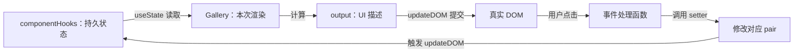
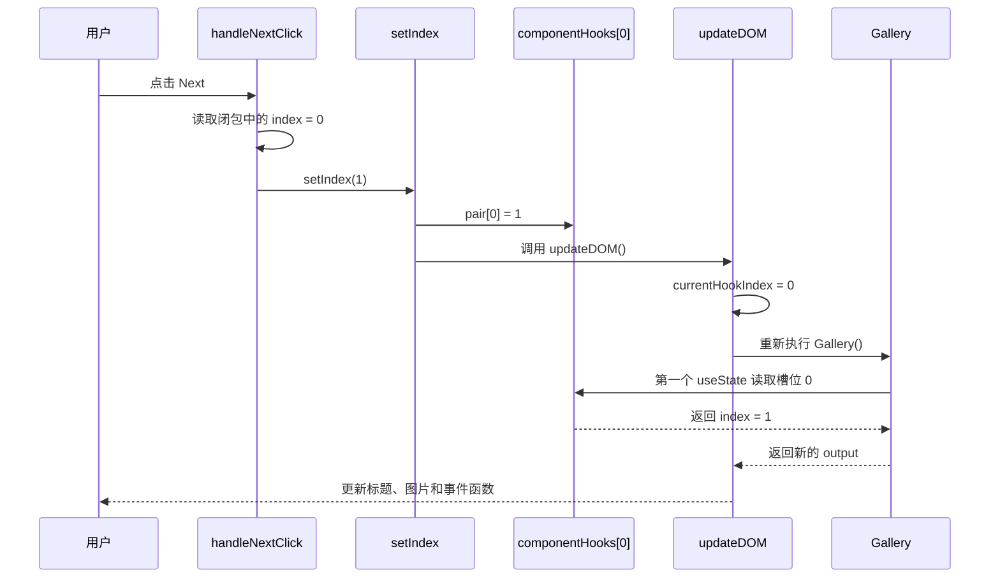

> `index.js`对应代码：

```
let componentHooks = [];
let currentHookIndex = 0;

// useState 在 React 中是如何工作的（简化版）
function useState(initialState) {
  let pair = componentHooks[currentHookIndex];
  if (pair) {
    // 这不是第一次渲染
    // 所以 state pair 已经存在
    // 将其返回并为下一次 hook 的调用做准备
    currentHookIndex++;
    return pair;
  }

  // 这是我们第一次进行渲染
  // 所以新建一个 state pair 然后存储它
  pair = [initialState, setState];

  function setState(nextState) {
    // 当用户发起 state 的变更，
    // 把新的值放入 pair 中
    pair[0] = nextState;
    updateDOM();
  }

  // 存储这个 pair 用于将来的渲染
  // 并且为下一次 hook 的调用做准备
  componentHooks[currentHookIndex] = pair;
  currentHookIndex++;
  return pair;
}

function Gallery() {
  // 每次调用 useState() 都会得到新的 pair
  const [index, setIndex] = useState(0);
  const [showMore, setShowMore] = useState(false);

  function handleNextClick() {
    setIndex(index + 1);
  }

  function handleMoreClick() {
    setShowMore(!showMore);
  }

  let sculpture = sculptureList[index];
  // 这个例子没有使用 React，所以
  // 返回一个对象而不是 JSX
  return {
    onNextClick: handleNextClick,
    onMoreClick: handleMoreClick,
    header: `${sculpture.name} by ${sculpture.artist}`,
    counter: `${index + 1} of ${sculptureList.length}`,
    more: `${showMore ? "Hide" : "Show"} details`,
    description: showMore ? sculpture.description : null,
    imageSrc: sculpture.url,
    imageAlt: sculpture.alt,
  };
}

function updateDOM() {
  // 在渲染组件之前
  // 重置当前 Hook 的下标
  currentHookIndex = 0;
  let output = Gallery();

  // 更新 DOM 以匹配输出结果
  // 这部分工作由 React 为你完成
  nextButton.onclick = output.onNextClick;
  header.textContent = output.header;
  moreButton.onclick = output.onMoreClick;
  moreButton.textContent = output.more;
  image.src = output.imageSrc;
  image.alt = output.imageAlt;
  if (output.description !== null) {
    description.textContent = output.description;
    description.style.display = "";
  } else {
    description.style.display = "none";
  }
}

let nextButton = document.getElementById("nextButton");
let header = document.getElementById("header");
let moreButton = document.getElementById("moreButton");
let description = document.getElementById("description");
let image = document.getElementById("image");
let sculptureList = [
  {
    name: "Homenaje a la Neurocirugía",
    artist: "Marta Colvin Andrade",
    description:
      "Although Colvin is predominantly known for abstract themes that allude to pre-Hispanic symbols, this gigantic sculpture, an homage to neurosurgery, is one of her most recognizable public art pieces.",
    url: "https://react.dev/images/docs/scientists/Mx7dA2Y.jpg",
    alt: "A bronze statue of two crossed hands delicately holding a human brain in their fingertips.",
  },
  {
    name: "Floralis Genérica",
    artist: "Eduardo Catalano",
    description:
      "This enormous (75 ft. or 23m) silver flower is located in Buenos Aires. It is designed to move, closing its petals in the evening or when strong winds blow and opening them in the morning.",
    url: "https://react.dev/images/docs/scientists/ZF6s192m.jpg",
    alt: "A gigantic metallic flower sculpture with reflective mirror-like petals and strong stamens.",
  },
  {
    name: "Eternal Presence",
    artist: "John Woodrow Wilson",
    description:
      'Wilson was known for his preoccupation with equality, social justice, as well as the essential and spiritual qualities of humankind. This massive (7ft. or 2,13m) bronze represents what he described as "a symbolic Black presence infused with a sense of universal humanity."',
    url: "https://react.dev/images/docs/scientists/aTtVpES.jpg",
    alt: "The sculpture depicting a human head seems ever-present and solemn. It radiates calm and serenity.",
  },
  {
    name: "Moai",
    artist: "Unknown Artist",
    description:
      "Located on the Easter Island, there are 1,000 moai, or extant monumental statues, created by the early Rapa Nui people, which some believe represented deified ancestors.",
    url: "https://react.dev/images/docs/scientists/RCwLEoQm.jpg",
    alt: "Three monumental stone busts with the heads that are disproportionately large with somber faces.",
  },
  {
    name: "Blue Nana",
    artist: "Niki de Saint Phalle",
    description:
      "The Nanas are triumphant creatures, symbols of femininity and maternity. Initially, Saint Phalle used fabric and found objects for the Nanas, and later on introduced polyester to achieve a more vibrant effect.",
    url: "https://react.dev/images/docs/scientists/Sd1AgUOm.jpg",
    alt: "A large mosaic sculpture of a whimsical dancing female figure in a colorful costume emanating joy.",
  },
  {
    name: "Ultimate Form",
    artist: "Barbara Hepworth",
    description:
      "This abstract bronze sculpture is a part of The Family of Man series located at Yorkshire Sculpture Park. Hepworth chose not to create literal representations of the world but developed abstract forms inspired by people and landscapes.",
    url: "https://react.dev/images/docs/scientists/2heNQDcm.jpg",
    alt: "A tall sculpture made of three elements stacked on each other reminding of a human figure.",
  },
  {
    name: "Cavaliere",
    artist: "Lamidi Olonade Fakeye",
    description:
      "Descended from four generations of woodcarvers, Fakeye's work blended traditional and contemporary Yoruba themes.",
    url: "https://react.dev/images/docs/scientists/wIdGuZwm.png",
    alt: "An intricate wood sculpture of a warrior with a focused face on a horse adorned with patterns.",
  },
  {
    name: "Big Bellies",
    artist: "Alina Szapocznikow",
    description:
      "Szapocznikow is known for her sculptures of the fragmented body as a metaphor for the fragility and impermanence of youth and beauty. This sculpture depicts two very realistic large bellies stacked on top of each other, each around five feet (1,5m) tall.",
    url: "https://react.dev/images/docs/scientists/AlHTAdDm.jpg",
    alt: "The sculpture reminds a cascade of folds, quite different from bellies in classical sculptures.",
  },
  {
    name: "Terracotta Army",
    artist: "Unknown Artist",
    description:
      "The Terracotta Army is a collection of terracotta sculptures depicting the armies of Qin Shi Huang, the first Emperor of China. The army consisted of more than 8,000 soldiers, 130 chariots with 520 horses, and 150 cavalry horses.",
    url: "https://react.dev/images/docs/scientists/HMFmH6m.jpg",
    alt: "12 terracotta sculptures of solemn warriors, each with a unique facial expression and armor.",
  },
  {
    name: "Lunar Landscape",
    artist: "Louise Nevelson",
    description:
      "Nevelson was known for scavenging objects from New York City debris, which she would later assemble into monumental constructions. In this one, she used disparate parts like a bedpost, juggling pin, and seat fragment, nailing and gluing them into boxes that reflect the influence of Cubism’s geometric abstraction of space and form.",
    url: "https://react.dev/images/docs/scientists/rN7hY6om.jpg",
    alt: "A black matte sculpture where the individual elements are initially indistinguishable.",
  },
  {
    name: "Aureole",
    artist: "Ranjani Shettar",
    description:
      'Shettar merges the traditional and the modern, the natural and the industrial. Her art focuses on the relationship between man and nature. Her work was described as compelling both abstractly and figuratively, gravity defying, and a "fine synthesis of unlikely materials."',
    url: "https://react.dev/images/docs/scientists/okTpbHhm.jpg",
    alt: "A pale wire-like sculpture mounted on concrete wall and descending on the floor. It appears light.",
  },
  {
    name: "Hippos",
    artist: "Taipei Zoo",
    description:
      "The Taipei Zoo commissioned a Hippo Square featuring submerged hippos at play.",
    url: "https://react.dev/images/docs/scientists/6o5Vuyu.jpg",
    alt: "A group of bronze hippo sculptures emerging from the sett sidewalk as if they were swimming.",
  },
];

// 使 UI 匹配当前 state
updateDOM();

```

> 阅读目标：能够沿着 `componentHooks → Gallery → output → DOM → 事件 → setState`，完整解释一次状态更新。

## 1. 先建立整体模型

这份 `index.js` 用普通 JavaScript 模拟了 React 函数组件和 `useState` 的基本行为。

| 教学实现               | 可以怎样理解                        |
| ---------------------- | ----------------------------------- |
| `componentHooks`       | 跨渲染保存状态的槽位数组            |
| `currentHookIndex`     | 本轮渲染正在读取第几个 Hook 的游标  |
| `useState()`           | 按调用顺序读取或创建状态槽位        |
| `Gallery()`            | 日常开发中的 React 函数组件         |
| `Gallery()` 返回的对象 | JSX/React 元素的简化替代品          |
| `updateDOM()`          | React“重新渲染并提交 DOM”的简化版本 |

完整数据流：




flowchart LR
A["componentHooks：持久状态"] -->|"useState 读取"| B["Gallery：本次渲染"]
B -->|"计算"| C["output：UI 描述"]
C -->|"updateDOM 提交"| D["真实 DOM"]
D -->|"用户点击"| E["事件处理函数"]
E -->|"调用 setter"| F["修改对应 pair"]
F -->|"触发 updateDOM"| A


需要始终区分三层数据：

1. `componentHooks` 是跨渲染存在的状态仓库。
2. `index`、`showMore` 是某一次 `Gallery()` 执行拿到的状态快照。
3. `output` 是根据这次快照计算出的 UI 描述。

---

## 2. 页面首次加载

脚本最先创建：

```js
let componentHooks = [];
let currentHookIndex = 0;
```

之后定义函数、找到 DOM 元素、创建 `sculptureList`，最后执行：

```js
updateDOM();
```

`updateDOM()` 做两件事：

```js
function updateDOM() {
  currentHookIndex = 0;
  let output = Gallery();

  // 把 output 写入 DOM，并绑定事件处理函数
}
```

- “渲染”：重新执行 `Gallery()`，得到 `output`。
- “提交”：把 `output` 中的文字、图片和事件函数写入 DOM。

### 2.1 第一个 Hook

`Gallery()` 首先执行：

```js
const [index, setIndex] = useState(0);
```

这时 `currentHookIndex === 0`，而 `componentHooks[0]` 不存在，所以创建：

```text
componentHooks[0] = [0, setIndex 对应的 setState]
currentHookIndex = 1
```

### 2.2 第二个 Hook

接着执行：

```js
const [showMore, setShowMore] = useState(false);
```

这时 `currentHookIndex === 1`，所以创建：

```text
componentHooks[1] = [false, setShowMore 对应的 setState]
currentHookIndex = 2
```

第一次执行完两个 Hook 后：

```text
componentHooks
├── 槽位 0: [0,     setIndex]
└── 槽位 1: [false, setShowMore]

本次 Gallery 快照
├── index = 0
└── showMore = false
```

初始值 `0` 和 `false` 只在对应槽位不存在时使用。后续渲染会读取已经存在的 `pair`。

---

## 3. `Gallery` 如何计算 UI

`Gallery` 可以理解为一个 React 函数组件：输入是当前 state 和外部数据，输出是 UI 描述。

```js
let sculpture = sculptureList[index];

return {
  onNextClick: handleNextClick,
  onMoreClick: handleMoreClick,
  header: `${sculpture.name} by ${sculpture.artist}`,
  more: `${showMore ? "Hide" : "Show"} details`,
  description: showMore ? sculpture.description : null,
  imageSrc: sculpture.url,
  imageAlt: sculpture.alt,
};
```

第一次渲染时：

```text
index = 0
    ↓
sculpture = sculptureList[0]
    ↓
header、imageSrc、imageAlt 使用第一件雕塑

showMore = false
    ↓
more = "Show details"
description = null
```

`Gallery` 不直接修改 DOM。它只根据当前快照计算 `output`；真正写 DOM 的是 `updateDOM()`。

> 代码中的 `output.counter` 已经被计算，但 `updateDOM()` 没有把它写入任何 DOM 元素，因此页面上不会显示计数器。

---

## 4. 点击 Next 时的数据流

第一次渲染创建了：

```js
function handleNextClick() {
  setIndex(index + 1);
}
```

这个函数被写入：

```js
nextButton.onclick = output.onNextClick;
```

假设当前 `index === 0`，点击 Next 后依次发生：




sequenceDiagram
participant U as 用户
participant H as handleNextClick
participant S as setIndex
participant P as componentHooks[0]
participant R as updateDOM
participant G as Gallery

    U->>H: 点击 Next
    H->>H: 读取闭包中的 index = 0
    H->>S: setIndex(1)
    S->>P: pair[0] = 1
    S->>R: 调用 updateDOM()
    R->>R: currentHookIndex = 0
    R->>G: 重新执行 Gallery()
    G->>P: 第一个 useState 读取槽位 0
    P-->>G: 返回 index = 1
    G-->>R: 返回新的 output
    R-->>U: 更新标题、图片和事件函数



关键状态变化：

| 阶段                     | `componentHooks[0][0]` | 本次 `Gallery` 中的 `index` |
| ------------------------ | ---------------------: | --------------------------: |
| 首次渲染                 |                    `0` |                         `0` |
| 点击 Next，setter 执行后 |                    `1` |            旧函数仍记得 `0` |
| 再次执行 `Gallery`       |                    `1` |                新快照为 `1` |

setter 修改的是持久槽位；`Gallery` 的局部变量不会被原地修改。下一次执行 `Gallery()` 时，才会从槽位中读取新值。

---

## 5. 这里有两层闭包

### 5.1 事件处理函数记住本次渲染快照

`handleNextClick` 记住本次 `Gallery()` 执行中的 `index` 和 `setIndex`：

```text
第 1 次 Gallery()
├── index₁ = 0
└── handleNextClick₁ → 读取 index₁

第 2 次 Gallery()
├── index₂ = 1
└── handleNextClick₂ → 读取 index₂
```

每次执行 `Gallery()` 都创建新的局部绑定和新的事件函数。`updateDOM()` 会把 DOM 上的旧处理函数替换成新处理函数。

JavaScript 闭包严格来说捕获的是词法环境中的“绑定”，不只是复制一个值；但每次调用 `Gallery()` 都会创建新的 `const index` 绑定，而且这个绑定在本次执行中不会改变，因此表现为“记住本次渲染的 state 快照”。

### 5.2 setter 记住持久状态槽位

`useState()` 内部创建的 `setState` 记住对应的 `pair`：

```js
function setState(nextState) {
  pair[0] = nextState;
  updateDOM();
}
```

所以闭包关系是：

```text
handleNextClick
├── 记住本次渲染的 index
└── 记住 setIndex
          └── setIndex 记住 componentHooks[0] 中的 pair
```

同理：

```text
handleMoreClick
├── 记住本次渲染的 showMore
└── setShowMore 记住 componentHooks[1] 中的 pair
```

---

## 6. 点击 More 时的数据流

```js
function handleMoreClick() {
  setShowMore(!showMore);
}
```

如果当前快照是：

```text
index = 1
showMore = false
```

点击后：

```js
setShowMore(!false);
// setShowMore(true)
```

第二个 setter 修改自己的 `pair`：

```text
componentHooks
├── 槽位 0: [1,    setIndex]
└── 槽位 1: [true, setShowMore]
```

重新渲染得到：

```text
index = 1
showMore = true
more = "Hide details"
description = sculpture.description
```

两个 state 位于不同槽位，所以更新 `showMore` 不会丢失 `index`。

一段典型操作的状态变化：

| 操作              | 槽位 0：`index` | 槽位 1：`showMore` |
| ----------------- | --------------: | -----------------: |
| 首次渲染          |             `0` |            `false` |
| 点击 Next         |             `1` |            `false` |
| 点击 Show details |             `1` |             `true` |
| 再点击 Next       |             `2` |             `true` |
| 点击 Hide details |             `2` |            `false` |

---

## 7. 为什么每次渲染前必须重置游标

第一次渲染调用两个 Hook 后：

```text
currentHookIndex = 2
```

下一次执行 `Gallery()` 时，第一个 `useState` 必须重新读取槽位 0，因此要先执行：

```js
currentHookIndex = 0;
```

这里重置的是“读取位置”，不是状态：

```text
componentHooks     → 保留，里面是跨渲染的状态
currentHookIndex   → 归零，新一轮从第一个 Hook 开始匹配
```

如果不归零，下一次渲染会从槽位 2 开始：

```text
第一个 useState  → 创建 componentHooks[2]
第二个 useState  → 创建 componentHooks[3]
```

结果是刚更新的槽位 0、1 没被读取，状态看起来回到初始值，而且数组会在每次渲染时不断增长。

可以把它类比为：

```text
componentHooks   = 保存数据的磁带
currentHookIndex = 磁带读取头

新一轮渲染开始时，磁带仍保留，但读取头必须回到起点。
```

---

## 8. 条件调用 Hook 为什么导致位置偏移

Hook 的“位置”不是变量名或代码行号，而是它在本轮渲染中第几个被调用。

```js
function Gallery({ canShowDetails }) {
  const [index, setIndex] = useState(0);

  if (canShowDetails) {
    const [showMore, setShowMore] = useState(false);
  }

  const [theme, setTheme] = useState("light");
}
```

条件成立时：

```text
槽位 0 → index
槽位 1 → showMore
槽位 2 → theme
```

下一次渲染条件不成立，第二个 Hook 被跳过：

```text
槽位 0 → index
槽位 1 → theme 错误读到原来的 showMore
```

于是：

```js
theme === false;
```

而且 `setTheme` 也拿到了原来属于 `showMore` 的 setter。调用：

```js
setTheme("dark");
```

实际会把槽位 1 改成 `"dark"`。如果条件再次成立，`showMore` 就会读到字符串 `"dark"`，不同状态发生串位和污染。

因此 Hook 必须始终在组件顶层、按固定顺序调用：

```js
function Gallery({ canShowDetails }) {
  const [index, setIndex] = useState(0);
  const [showMore, setShowMore] = useState(false);
  const [theme, setTheme] = useState("light");

  const shouldShowDetails = canShowDetails && showMore;
}
```

把条件用于计算或渲染结果，不要用于决定是否调用 Hook。

---

## 9. 教学实现与真实 React 的区别

这份代码适合解释基本模型，但不能直接等同于 React 源码。

| 当前教学实现                  | 真实 React                                  |
| ----------------------------- | ------------------------------------------- |
| `setState` 直接修改 `pair[0]` | setter 创建更新并加入更新队列               |
| setter 同步调用 `updateDOM()` | React 会批处理、调度并选择渲染时机          |
| 所有 Hook 存在一个全局数组里  | 每个组件实例都有自己的 Hook 状态结构        |
| 只接受直接的新值              | 支持直接值和函数式更新                      |
| 没有相同值跳过机制            | React 可用 `Object.is` 判断并跳过不必要更新 |
| 条件 Hook 会静默串位          | 真实 React 开发环境通常会报告 Hook 顺序错误 |

尤其注意：这个简化 setter 不支持函数式更新。

```js
// 在真实 React 中正确
setIndex((i) => i + 1);

// 在当前教学实现中会把函数本身存进 pair[0]，导致后续代码出错
```

真实 React 的进一步阅读：

- [State as a Snapshot](https://react.dev/learn/state-as-a-snapshot)
- [Queueing a Series of State Updates](https://react.dev/learn/queueing-a-series-of-state-updates)
- [`useState` API](https://react.dev/reference/react/useState)

---

## 10. 日常开发心智模型

把整个过程压缩成四句话：

1. 函数组件每次渲染都会重新执行。
2. 本次执行读取到的 state 是本次渲染的快照。
3. 事件函数通过闭包读取创建它的那次渲染快照。
4. setter 请求更新持久状态，React 在下一次渲染中提供新快照。

对于当前示例，则是：

```text
事件函数读取 index/showMore 快照
        ↓
setter 修改自己记住的 pair
        ↓
updateDOM 重置 Hook 游标
        ↓
Gallery 重新执行并读取新状态
        ↓
output 更新 DOM 和事件函数
```

---

## 11. 自测题

### Q1：第一次执行 `Gallery()` 后，状态数组和游标是什么？

<details>
<summary>查看答案</summary>

```text
componentHooks[0][0] = 0
componentHooks[1][0] = false
currentHookIndex = 2
```

两个 Hook 各自创建一个槽位，每调用一次 `useState`，游标加一。

</details>

### Q2：为什么点击 Next 后，旧的 `handleNextClick` 中的 `index` 不会从 0 直接变成 1？

<details>
<summary>查看答案</summary>

因为 setter 修改的是持久的 `pair[0]`，不是当前 `Gallery()` 执行中的 `const index`。旧处理函数仍然读取创建它的那次渲染绑定；重新执行 `Gallery()` 后，新的 `index` 才从槽位中读到 1，并创建新的处理函数。

</details>

### Q3：如果删除 `currentHookIndex = 0`，点击 Next 后会怎样？

<details>
<summary>查看答案</summary>

上一轮渲染结束时游标已经是 2。下一轮会从槽位 2、3 创建新的状态，而不会读取刚更新的槽位 0、1。因此 UI 看起来回到初始状态，`componentHooks` 还会持续增长。

</details>

### Q4：`handleNextClick` 和 `setIndex` 分别通过闭包记住什么？

<details>
<summary>查看答案</summary>

- `handleNextClick` 记住本次 `Gallery()` 执行中的 `index` 和 `setIndex`。
- `setIndex` 对应的内部 `setState` 记住第一个状态槽位的 `pair`。

</details>

### Q5：条件跳过第二个 Hook 后，为什么 `theme` 会读到 `showMore`？

<details>
<summary>查看答案</summary>

因为 Hook 按调用次序读取槽位。跳过 `showMore` 后，`theme` 从本轮第三个 Hook 变成第二个 Hook，于是读取槽位 1，而槽位 1 保存的是上一轮的 `showMore`。

</details>

### Q6：以下哪种条件使用方式是正确的？为什么？

```js
// A
if (canShowDetails) {
  const [showMore, setShowMore] = useState(false);
}

// B
const [showMore, setShowMore] = useState(false);
const shouldShowDetails = canShowDetails && showMore;
```

<details>
<summary>查看答案</summary>

B。它保证每次渲染都会按相同顺序调用 Hook，把条件放在状态读取后的普通计算中，因此不会产生状态槽位偏移。

</details>
